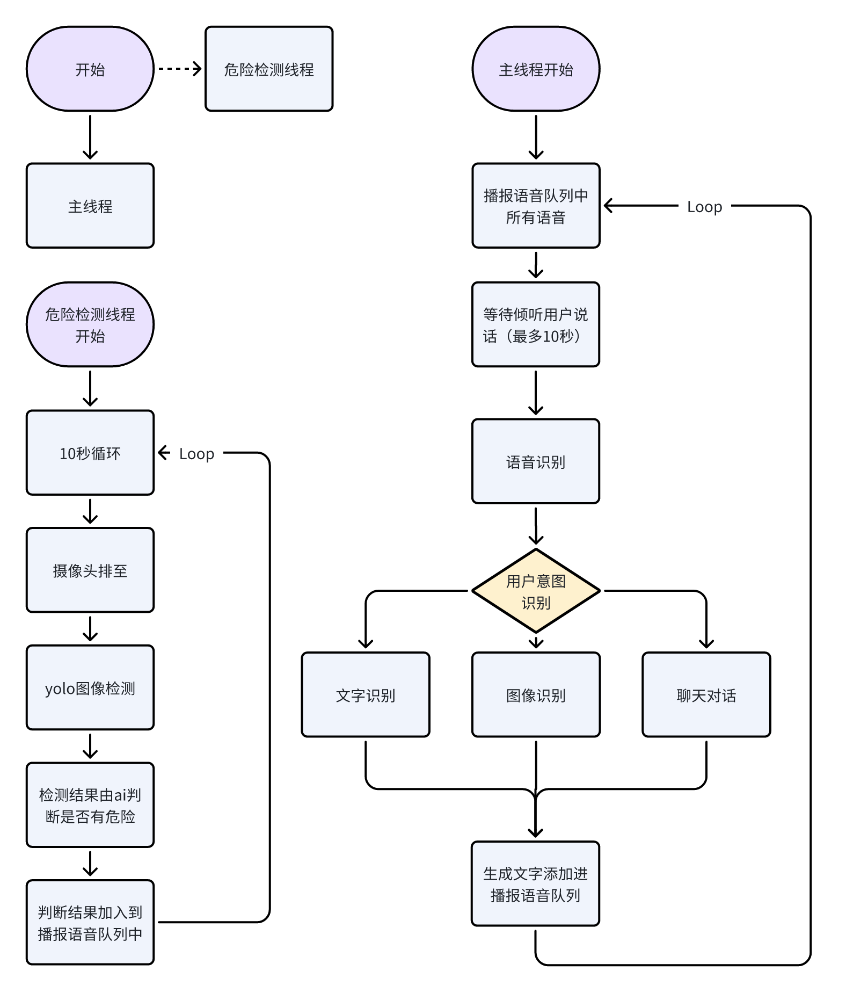

# AI1101-Project
AI1101 人工智能交互技术 综合作业

# 智能无障碍交互助手
## 项目需求
- 为视障用户提供图像环境感知（OCR+图像识别）
- 危险检测：通过预设标签库识别尖锐等危险物品
- 日常交流：ErnieBot，理解复杂语义，生成自然对话

## 项目结构


## 文件结构
```
./AI1101-Project/
├── README.md
├── images
│   └── flowchart.png
├── main.py               // 主程序
└── yolov10n.pt           // yolo图像识别模型
```

## 使用指南
```
python main.py
```
启动程序，等待Listening提示出现，即可开始对话。助手将自动识别用户意图，并调用响应功能。与此同时，系统实时监测用户环境，及时提醒用户身边危险物品。